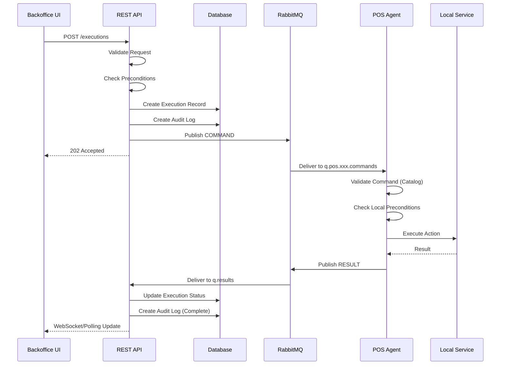
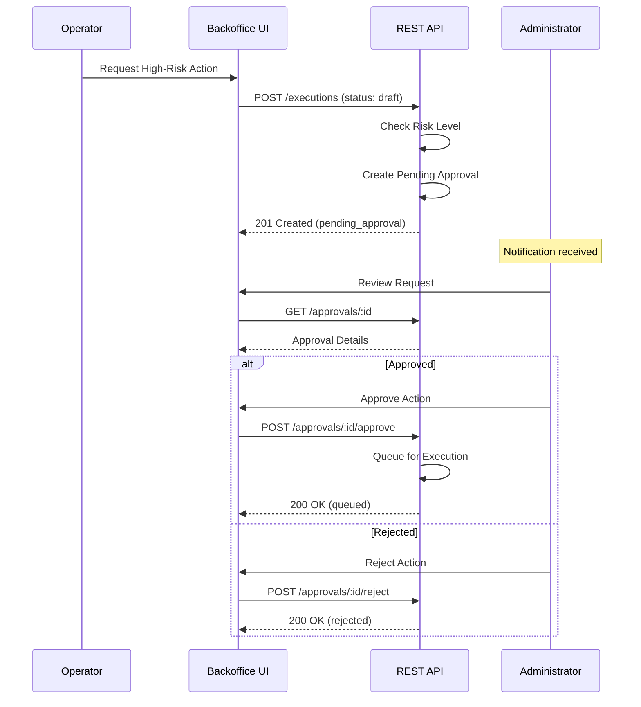
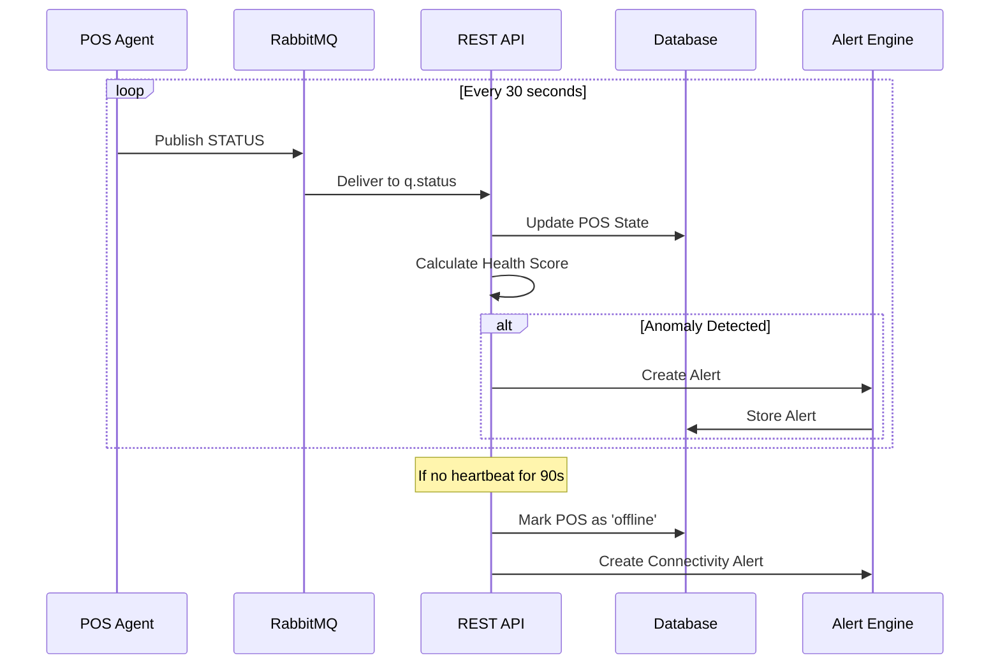

# Arquitectura del Sistema - Documentación Técnica

> **Versión:** 2.0  
> **Última actualización:** 2026-02-06  
> **Estado:** Producción

---

## Índice

1. [Visión General](#visión-general)
2. [Diagrama de Arquitectura](#diagrama-de-arquitectura)
3. [Componentes del Sistema](#componentes-del-sistema)
4. [Patrones de Diseño](#patrones-de-diseño)
5. [Flujos de Datos](#flujos-de-datos)
6. [Observabilidad](#observabilidad)
7. [Seguridad](#seguridad)
8. [Estructura del Proyecto](#estructura-del-proyecto)
9. [Extensibilidad](#extensibilidad)

---

## Visión General

El sistema implementa un modelo de **Governed Automation** para la gestión remota de terminales POS en la red de tiendas FashionPark. La arquitectura sigue principios de separación de responsabilidades, trazabilidad total y seguridad por diseño.

### Principios Arquitectónicos

| Principio | Descripción |
|-----------|-------------|
| **Separación de Responsabilidades** | Control Plane decide, Edge ejecuta |
| **Catálogo Cerrado** | Solo comandos predefinidos son válidos |
| **Trazabilidad Total** | Cada acción tiene `correlation_id` end-to-end |
| **Seguridad por Diseño** | mTLS, sin shell remoto, sin scripts arbitrarios |
| **Observabilidad Nativa** | OpenTelemetry integrado desde el diseño |
| **Idempotencia Obligatoria** | Cada mensaje tiene `message_id` único |

### Modelo de Gobernanza

```
┌─────────────────────────────────────────────────────────────────┐
│                    GOVERNANCE MODEL                              │
├─────────────────────────────────────────────────────────────────┤
│  DECISION         │  EXECUTION        │  EVIDENCE               │
│  (Control Plane)  │  (Edge/Agent)     │  (Observability)        │
├───────────────────┼───────────────────┼─────────────────────────┤
│  • Autorización   │  • Validación     │  • Traces               │
│  • Aprobación     │  • Ejecución      │  • Métricas             │
│  • Auditoría      │  • Reporte        │  • Logs                 │
│  • Políticas      │  • Heartbeat      │  • Alertas              │
└───────────────────┴───────────────────┴─────────────────────────┘
```

---

## Diagrama de Arquitectura

### Vista de Alto Nivel

```
                                 ┌─────────────────────────────────┐
                                 │         OBSERVABILITY           │
                                 │  ┌─────────┐  ┌─────────────┐  │
                                 │  │ Jaeger  │  │ Prometheus  │  │
                                 │  └────┬────┘  └──────┬──────┘  │
                                 │       │              │         │
                                 │  ┌────┴──────────────┴────┐    │
                                 │  │    OpenTelemetry       │    │
                                 │  │      Collector         │    │
                                 │  └────────────┬───────────┘    │
                                 └───────────────┼────────────────┘
                                                 │
┌────────────────────────────────────────────────┼────────────────────────────────────────┐
│                                CONTROL PLANE   │                                         │
│  ┌─────────────────┐   ┌─────────────────┐    │    ┌─────────────────┐                  │
│  │                 │   │                 │    │    │                 │                  │
│  │   Backoffice    │◄──│   REST API      │◄───┼────│   PostgreSQL    │                  │
│  │      UI         │──►│   Gateway       │────┼───►│   Database      │                  │
│  │   (React)       │   │   (Node.js)     │    │    │                 │                  │
│  │                 │   │                 │    │    └─────────────────┘                  │
│  └─────────────────┘   └────────┬────────┘    │                                         │
│                                 │             │                                         │
│                                 │ AMQP        │                                         │
│                                 ▼             │                                         │
│                        ┌─────────────────┐    │                                         │
│                        │                 │    │                                         │
│                        │    RabbitMQ     │◄───┘                                         │
│                        │    Cluster      │                                              │
│                        │                 │                                              │
│                        └────────┬────────┘                                              │
└─────────────────────────────────┼───────────────────────────────────────────────────────┘
                                  │ mTLS
                                  │
          ┌───────────────────────┼───────────────────────┐
          │                       │                       │
          ▼                       ▼                       ▼
┌─────────────────┐     ┌─────────────────┐     ┌─────────────────┐
│   EDGE LAYER    │     │   EDGE LAYER    │     │   EDGE LAYER    │
│    Store 01     │     │    Store 02     │     │    Store N      │
├─────────────────┤     ├─────────────────┤     ├─────────────────┤
│  ┌───────────┐  │     │  ┌───────────┐  │     │  ┌───────────┐  │
│  │ POS Agent │  │     │  │ POS Agent │  │     │  │ POS Agent │  │
│  │  (Python) │  │     │  │  (Python) │  │     │  │  (Python) │  │
│  └─────┬─────┘  │     │  └─────┬─────┘  │     │  └─────┬─────┘  │
│        │        │     │        │        │     │        │        │
│  ┌─────┴─────┐  │     │  ┌─────┴─────┐  │     │  ┌─────┴─────┐  │
│  │SPDH│ TBK  │  │     │  │SPDH│ TBK  │  │     │  │SPDH│ TBK  │  │
│  └───────────┘  │     │  └───────────┘  │     │  └───────────┘  │
└─────────────────┘     └─────────────────┘     └─────────────────┘
```

### Vista de Flujo de Mensajes

```
┌──────────────┐     ┌──────────────┐     ┌──────────────┐     ┌──────────────┐
│   OPERATOR   │     │  BACKOFFICE  │     │  REST API    │     │  RABBITMQ    │
│              │     │     UI       │     │  GATEWAY     │     │              │
└──────┬───────┘     └──────┬───────┘     └──────┬───────┘     └──────┬───────┘
       │                    │                    │                    │
       │  1. Request Action │                    │                    │
       │───────────────────►│                    │                    │
       │                    │                    │                    │
       │                    │  2. POST /executions                    │
       │                    │───────────────────►│                    │
       │                    │                    │                    │
       │                    │                    │  3. Validate       │
       │                    │                    │  & Create Audit    │
       │                    │                    │────┐               │
       │                    │                    │    │               │
       │                    │                    │◄───┘               │
       │                    │                    │                    │
       │                    │                    │  4. Publish COMMAND│
       │                    │                    │───────────────────►│
       │                    │                    │                    │
       │                    │  5. 202 Accepted   │                    │
       │                    │◄───────────────────│                    │
       │                    │                    │                    │
       │  6. Status Update  │                    │                    │
       │◄───────────────────│                    │                    │
       │   (Polling/WS)     │                    │                    │
       │                    │                    │                    │
```

---

## Componentes del Sistema

### 1. Backoffice UI (Este Proyecto)

**Responsabilidades:**
- Visualización del estado de la red POS en tiempo real
- Orquestación de acciones con validación de políticas
- Flujo de aprobaciones para acciones de alto riesgo
- Registro y exportación de auditoría
- Dashboard de métricas y observabilidad

**Stack Tecnológico:**

| Tecnología | Propósito |
|------------|-----------|
| React 18 | Framework UI |
| TypeScript | Type safety |
| Vite | Build tool |
| TailwindCSS | Estilos |
| shadcn/ui | Componentes UI |
| TanStack Query | Data fetching & cache |
| React Router | Navegación SPA |
| Recharts | Visualización de datos |

**Modos de Operación:**

```typescript
// src/config/apiConfig.ts
export const apiConfig = {
  useMockData: import.meta.env.VITE_USE_MOCK_DATA !== 'false',
  baseUrl: import.meta.env.VITE_API_BASE_URL || 'http://localhost:4000',
  timeoutMs: Number(import.meta.env.VITE_API_TIMEOUT_MS || 15000),
};
```

| Modo | Uso | Configuración |
|------|-----|---------------|
| **Demo** | Desarrollo, demos | `VITE_USE_MOCK_DATA=true` |
| **API** | Staging, producción | `VITE_USE_MOCK_DATA=false` |

### 2. REST API Gateway

**Responsabilidades:**
- Autenticación JWT y autorización RBAC
- Validación de requests contra esquemas
- Traducción HTTP → AMQP
- Agregación de datos para dashboard
- Gestión de sesiones y tokens

**Endpoints Principales:**

| Grupo | Base Path | Descripción |
|-------|-----------|-------------|
| POS | `/api/pos` | Gestión de terminales |
| Actions | `/api/actions` | Catálogo de acciones |
| Executions | `/api/executions` | Ejecución de comandos |
| Approvals | `/api/approvals` | Flujo de aprobaciones |
| Metrics | `/api/metrics` | Métricas del dashboard |
| Audit | `/api/audit` | Logs de auditoría |
| Alerts | `/api/alerts` | Gestión de alertas |

**Headers de Trazabilidad:**

```http
X-Request-ID: req-550e8400-e29b-41d4-a716-446655440000
X-Trace-ID: 4bf92f3577b34da6a3ce929d0e0e4736
X-Correlation-ID: corr-1706745600000-a1b2c3d4
Authorization: Bearer <jwt_token>
```

### 3. RabbitMQ Broker

**Responsabilidades:**
- Transporte de mensajes con garantía de entrega
- Enrutamiento topic-based por POS
- Dead Letter Queues para análisis forense
- TTL para comandos expirados
- Aislamiento por ambiente (vhosts)

**Topología:**

```
┌─────────────────────────────────────────────────────────────────┐
│                     RABBITMQ TOPOLOGY                            │
├─────────────────────────────────────────────────────────────────┤
│                                                                  │
│  EXCHANGES (Topic)                                               │
│  ┌────────────────┐  ┌────────────────┐  ┌────────────────┐     │
│  │  ex.commands   │  │   ex.results   │  │   ex.status    │     │
│  └───────┬────────┘  └───────┬────────┘  └───────┬────────┘     │
│          │                   │                   │               │
│          │ Routing Keys:     │                   │               │
│          │ pos.{region}.     │                   │               │
│          │ {store}.{pos_id}  │                   │               │
│          │ .command          │                   │               │
│          │                   │                   │               │
│  ┌───────┴────────┐  ┌───────┴────────┐  ┌───────┴────────┐     │
│  │ q.pos.xxx.     │  │   q.results    │  │   q.status     │     │
│  │   commands     │  │                │  │                │     │
│  ├────────────────┤  └────────────────┘  └────────────────┘     │
│  │ TTL: 2 min     │                                              │
│  │ DLQ: .dlq      │                                              │
│  └────────────────┘                                              │
│                                                                  │
│  VHOSTS (Environment Isolation)                                  │
│  ┌────────────┐  ┌────────────┐  ┌────────────┐                 │
│  │  /lab-pos  │  │/staging-pos│  │ /prod-pos  │                 │
│  └────────────┘  └────────────┘  └────────────┘                 │
│                                                                  │
└─────────────────────────────────────────────────────────────────┘
```

**Configuración de Colas:**

| Cola | TTL | DLQ | Propósito |
|------|-----|-----|-----------|
| `q.pos.{id}.commands` | 2 min | ✓ | Comandos por POS |
| `q.results` | 1 hora | ✗ | Resultados agregados |
| `q.status` | 5 min | ✗ | Heartbeats |
| `q.telemetry` | 10 min | ✗ | Métricas OTEL |

### 4. POS Agent (Componente Externo)

**Responsabilidades:**
- Consumo de comandos de la cola asignada
- Validación local de comandos (catálogo cerrado)
- Ejecución de acciones sobre servicios locales
- Reporte de resultados y telemetría
- Heartbeat periódico (cada 30s)

**Servicios Gestionados:**

| Servicio | ID | Descripción |
|----------|----|-------------|
| SPDH | `svc_spdh` | Servicio de pagos directo |
| Transbank | `svc_tbk` | Integración Transbank |
| Llaves Directo | `svc_llaves` | Gestión de llaves criptográficas |

**Implementación:** Python 3.11+ (no incluido en este proyecto)

### 5. PostgreSQL Database

**Responsabilidades:**
- Persistencia de estado de POS y tiendas
- Registro de ejecuciones y auditoría
- Gestión de usuarios y roles
- Histórico de métricas

**Esquema Principal:**

```sql
-- Entidades principales
pos              -- Terminales POS
stores           -- Tiendas
regions          -- Regiones geográficas
users            -- Usuarios del backoffice

-- Operaciones
executions       -- Ejecuciones de comandos
approvals        -- Flujo de aprobaciones
audit_logs       -- Auditoría inmutable

-- Observabilidad
alerts           -- Alertas del sistema
incidents        -- Gestión de incidentes
```

---

## Patrones de Diseño

### Data Access Pattern

```
┌─────────────┐     ┌─────────────┐     ┌─────────────┐     ┌─────────────┐
│  Component  │────►│    Hook     │────►│   Service   │────►│ HttpClient  │
└─────────────┘     └─────────────┘     └─────────────┘     └─────────────┘
      UI              useXxxData()        xxxService          httpClient
                                                                   │
                                                                   ▼
                                                            ┌─────────────┐
                                                            │  REST API   │
                                                            └─────────────┘
```

**Reglas:**
1. Los componentes **solo** consumen datos a través de hooks
2. Los hooks **solo** interactúan con servicios de dominio
3. Los servicios **solo** usan el HttpClient centralizado
4. El HttpClient maneja timeouts, errores y headers de trazabilidad

### Dual-Mode Operation

```typescript
// En hooks:
const useActionsData = () => {
  const { useMockData } = apiConfig;
  
  return useQuery({
    queryKey: ['actions'],
    queryFn: async () => {
      if (useMockData) {
        return mockActions; // Modo Demo
      }
      return actionsService.listActions(); // Modo API
    },
  });
};
```

### Command Pattern (Mensajería)

Cada comando sigue un ciclo de vida estricto:

```
┌──────────┐     ┌──────────┐     ┌──────────┐     ┌──────────┐
│  draft   │────►│ pending_ │────►│  queued  │────►│   sent   │
│          │     │ approval │     │          │     │          │
└──────────┘     └──────────┘     └──────────┘     └──────────┘
                      │                                  │
                      │ rejected                         │
                      ▼                                  ▼
                 ┌──────────┐                      ┌──────────┐
                 │ rejected │                      │ in_prog. │
                 └──────────┘                      └──────────┘
                                                        │
                              ┌──────────────────┬──────┴──────┐
                              ▼                  ▼             ▼
                         ┌──────────┐      ┌──────────┐  ┌──────────┐
                         │ success  │      │  failed  │  │ blocked  │
                         └──────────┘      └──────────┘  └──────────┘
```

### Evidence Pattern

Cada operación genera tres IDs de trazabilidad:

```typescript
interface EvidenceIds {
  message_id: string;      // UUID - Idempotencia del mensaje
  correlation_id: string;  // End-to-end tracing (UI → Agent)
  trace_id: string;        // OpenTelemetry trace
}
```

---

## Flujos de Datos

### Flujo de Ejecución de Acción



### Flujo de Aprobación



### Flujo de Heartbeat y Status



---

## Observabilidad

### Stack de Observabilidad

```
┌─────────────────────────────────────────────────────────────────┐
│                    OBSERVABILITY STACK                           │
├─────────────────────────────────────────────────────────────────┤
│                                                                  │
│  ┌─────────────┐  ┌─────────────┐  ┌─────────────┐              │
│  │   Traces    │  │   Metrics   │  │    Logs     │              │
│  │   (Jaeger)  │  │(Prometheus) │  │   (Loki)    │              │
│  └──────┬──────┘  └──────┬──────┘  └──────┬──────┘              │
│         │                │                │                      │
│         └────────────────┼────────────────┘                      │
│                          │                                       │
│                   ┌──────┴──────┐                                │
│                   │   Grafana   │                                │
│                   │  Dashboard  │                                │
│                   └─────────────┘                                │
│                                                                  │
│  ┌─────────────────────────────────────────────────────────┐    │
│  │                 OpenTelemetry Collector                  │    │
│  │  ┌─────────┐  ┌─────────┐  ┌─────────┐  ┌─────────┐    │    │
│  │  │Receiver │  │Processor│  │Exporter │  │Exporter │    │    │
│  │  │ (OTLP)  │──│ (Batch) │──│(Jaeger) │──│(Prom)   │    │    │
│  │  └─────────┘  └─────────┘  └─────────┘  └─────────┘    │    │
│  └─────────────────────────────────────────────────────────┘    │
│                          ▲                                       │
│                          │ OTLP                                  │
│         ┌────────────────┼────────────────┐                      │
│         │                │                │                      │
│  ┌──────┴──────┐  ┌──────┴──────┐  ┌──────┴──────┐              │
│  │  REST API   │  │  POS Agent  │  │  RabbitMQ   │              │
│  └─────────────┘  └─────────────┘  └─────────────┘              │
│                                                                  │
└─────────────────────────────────────────────────────────────────┘
```

### Métricas Clave

| Métrica | Tipo | Descripción |
|---------|------|-------------|
| `pos_health_score` | Gauge | Puntaje de salud 0-100 |
| `command_latency_ms` | Histogram | Latencia de ejecución |
| `commands_total` | Counter | Total de comandos por estado |
| `heartbeat_lag_seconds` | Gauge | Retraso del último heartbeat |
| `active_alerts_count` | Gauge | Alertas activas por severidad |

### Dashboards del Backoffice

| Dashboard | Propósito |
|-----------|-----------|
| **Overview** | Estado general de la red POS |
| **POS Detail** | Detalle de terminal específico |
| **Executions** | Historial y estado de ejecuciones |
| **Audit** | Logs de auditoría con filtros |
| **Observability** | Métricas técnicas y alertas |

---

## Seguridad

### Modelo de Seguridad

```
┌─────────────────────────────────────────────────────────────────┐
│                    SECURITY LAYERS                               │
├─────────────────────────────────────────────────────────────────┤
│                                                                  │
│  Layer 1: AUTHENTICATION                                         │
│  ┌─────────────────────────────────────────────────────────┐    │
│  │  JWT Tokens + MFA + Session Management                   │    │
│  └─────────────────────────────────────────────────────────┘    │
│                                                                  │
│  Layer 2: AUTHORIZATION (RBAC)                                   │
│  ┌─────────────────────────────────────────────────────────┐    │
│  │  Operator │ Admin │ Auditor                              │    │
│  │  Limited  │ Full  │ Read-only                            │    │
│  └─────────────────────────────────────────────────────────┘    │
│                                                                  │
│  Layer 3: TRANSPORT                                              │
│  ┌─────────────────────────────────────────────────────────┐    │
│  │  mTLS with unique certificates per POS                   │    │
│  │  CN=pos-{pos_id}.store-{store_id}.{env}.fashionpark.cl  │    │
│  └─────────────────────────────────────────────────────────┘    │
│                                                                  │
│  Layer 4: COMMAND VALIDATION                                     │
│  ┌─────────────────────────────────────────────────────────┐    │
│  │  Closed Catalog │ Preconditions │ Cooldowns             │    │
│  └─────────────────────────────────────────────────────────┘    │
│                                                                  │
└─────────────────────────────────────────────────────────────────┘
```

### RBAC - Matriz de Permisos

| Recurso | Operator | Admin | Auditor |
|---------|----------|-------|---------|
| POS - Ver | ✓ | ✓ | ✓ |
| Actions - Solicitar | ✓ | ✓ | ✗ |
| Actions - Ejecutar directo | ✗ | ✓ | ✗ |
| Approvals - Aprobar | ✗ | ✓ | ✗ |
| Audit - Ver | ✓ | ✓ | ✓ |
| Audit - Exportar | ✗ | ✓ | ✓ |
| Users - Gestionar | ✗ | ✓ | ✗ |
| Alerts - Resolver | ✓ | ✓ | ✗ |

### Restricciones del Backoffice

| ❌ Prohibido | ✅ Permitido |
|-------------|-------------|
| Ejecutar scripts arbitrarios | Enviar `action_id` predefinidos |
| Acceso SSH/Shell a POS | Ver estado via heartbeat |
| Modificar configuración directa | Solicitar cambio de config |
| Acceso a datos de transacciones | Ver métricas agregadas |
| Envío de payloads custom | Parámetros validados por schema |

---

## Estructura del Proyecto

```
src/
├── components/
│   ├── commands/          # Componentes de comandos y aprobaciones
│   │   ├── ApprovalFilters.tsx
│   │   ├── CommandHistoryFilters.tsx
│   │   ├── CommandStatusBadge.tsx
│   │   └── ExportAuditButton.tsx
│   │
│   ├── dashboard/         # Componentes del dashboard
│   │   ├── AlertsList.tsx
│   │   ├── LiveIndicator.tsx
│   │   ├── MetricCard.tsx
│   │   ├── POSStatusChart.tsx
│   │   ├── RecentActionsTable.tsx
│   │   └── StatusIndicator.tsx
│   │
│   ├── layout/            # Layout components
│   │   ├── Header.tsx
│   │   ├── MainLayout.tsx
│   │   ├── Sidebar.tsx
│   │   └── ThemeSwitch.tsx
│   │
│   ├── operations/        # Componentes de operaciones
│   │   ├── ActionCard.tsx
│   │   ├── ActionTimeline.tsx
│   │   ├── EvidencePanel.tsx
│   │   ├── PreflightModal.tsx
│   │   └── StatusPill.tsx
│   │
│   └── ui/                # shadcn/ui components
│
├── config/
│   └── apiConfig.ts       # Configuración centralizada
│
├── contexts/
│   └── ThemeContext.tsx   # Contexto de tema
│
├── data/
│   ├── mockData.ts        # Datos mock para modo demo
│   ├── mockCommandData.ts # Datos mock de comandos
│   ├── mockOperationsData.ts
│   └── mockSimulation.ts  # Simulación de estados
│
├── hooks/
│   ├── useActionsData.ts  # Hook de acciones
│   ├── useAuditData.ts    # Hook de auditoría
│   ├── useCommandData.ts  # Hook de comandos
│   ├── useExecuteAction.ts
│   ├── useObservabilityData.ts
│   ├── usePOSData.ts      # Hook de POS
│   ├── usePolling.ts      # Hook de polling
│   └── useStoresData.ts
│
├── lib/
│   ├── httpClient.ts      # Cliente HTTP centralizado
│   ├── exportAudit.ts     # Exportación de auditoría
│   └── utils.ts           # Utilidades generales
│
├── pages/
│   ├── Dashboard.tsx      # Vista principal
│   ├── ActionsPage.tsx    # Catálogo de acciones
│   ├── ApprovalsPage.tsx  # Gestión de aprobaciones
│   ├── AuditPageV2.tsx    # Auditoría
│   ├── CommandHistoryPage.tsx
│   ├── ExecuteActionPage.tsx
│   ├── IncidentsPage.tsx
│   ├── ObservabilityPage.tsx
│   ├── POSDetailPage.tsx
│   ├── StoresPage.tsx
│   └── ...
│
├── services/
│   ├── actionsService.ts  # Servicio de acciones
│   ├── auditService.ts    # Servicio de auditoría
│   ├── incidentsService.ts
│   ├── metricsService.ts  # Servicio de métricas
│   └── posService.ts      # Servicio de POS
│
└── types/
    ├── index.ts           # Tipos de dominio
    ├── api.ts             # Tipos de API
    ├── commands.ts        # Protocolo de mensajes
    └── theme.ts           # Tipos de tema

docs/
├── ARCHITECTURE.md        # Este documento
├── API.md                 # Especificación de API REST
├── MESSAGE_PROTOCOL.md    # Contratos de mensajes
└── THEMING.md             # Sistema de temas
```

### Responsabilidades por Capa

| Capa | Archivos | Responsabilidad |
|------|----------|-----------------|
| **UI** | `pages/`, `components/` | Renderizado y eventos |
| **State** | `hooks/` | Gestión de estado y side effects |
| **Domain** | `services/` | Lógica de negocio y transformaciones |
| **Data** | `lib/httpClient.ts` | Comunicación HTTP |
| **Types** | `types/` | Contratos y validación |
| **Config** | `config/` | Configuración de entorno |

---

## Extensibilidad

### Agregar Nuevo Comando

1. **Añadir al catálogo** en `src/types/commands.ts`:
```typescript
export const COMMAND_CATALOG = {
  // ...existing
  NEW_COMMAND: 'NEW_COMMAND',
} as const;
```

2. **Definir payload** si es necesario:
```typescript
export interface NewCommandPayload {
  param1: string;
  param2?: number;
}
```

3. **Configurar reglas** en el backend:
```typescript
{
  command: 'NEW_COMMAND',
  risk_level: 'medium',
  requires_approval: true,
  cooldown_seconds: 300,
}
```

4. **Actualizar el agente POS** (componente externo)

5. **Añadir acción** en el catálogo de la API

### Agregar Nuevo Servicio Frontend

1. **Crear servicio** `src/services/newService.ts`:
```typescript
import { httpClient } from '@/lib/httpClient';

export const newService = {
  async list(): Promise<NewEntity[]> {
    return httpClient.get<NewEntity[]>('/api/new-entity');
  },
};
```

2. **Crear hook** `src/hooks/useNewData.ts`:
```typescript
import { useQuery } from '@tanstack/react-query';
import { apiConfig } from '@/config/apiConfig';
import { newService } from '@/services/newService';
import { mockNewData } from '@/data/mockNewData';

export const useNewData = () => {
  return useQuery({
    queryKey: ['new-entity'],
    queryFn: async () => {
      if (apiConfig.useMockData) {
        return mockNewData;
      }
      return newService.list();
    },
  });
};
```

3. **Añadir datos mock** si es necesario en `src/data/`

### Agregar Nueva Página

1. **Crear página** en `src/pages/NewPage.tsx`
2. **Añadir ruta** en `src/App.tsx`
3. **Añadir enlace** en `src/components/layout/Sidebar.tsx`

---

## Referencias

- [API.md](./API.md) - Especificación completa de la API REST
- [MESSAGE_PROTOCOL.md](./MESSAGE_PROTOCOL.md) - Contratos de mensajes AMQP
- [THEMING.md](./THEMING.md) - Sistema de temas y diseño
